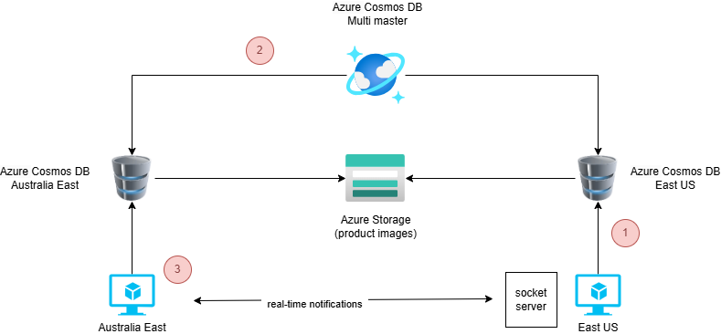

# Geo-replication in Azure Cosmos DB

This repository contains a project for setting up and demonstrating geo-replication with Azure Cosmos DB. The project is divided into 2 parts:

- Backend application: .NET WebAPI application that talks to an Azure Cosmos DB NoSQL database
- Frontend application: NextJS 15 application that displays a products catalog

Products added to the shopping cart in the East US 2 region automatically appear in the Australia East region, thanks to Azure Cosmos DB global distribution features.


## Azure Architecture

- 2 virtual machines, one in East US 2, the other one in Australia East
- An Azure Storage account to store product images
- an Azure Cosmos DB NoSQL database that stores the product catalog



## References

- [Benefits of global distribution in Azure Cosmos DB](https://learn.microsoft.com/en-us/azure/cosmos-db/distribute-data-globally)
- [Create an Azure Cosmos DB for NoSQL account](https://learn.microsoft.com/en-us/azure/cosmos-db/nosql/quickstart-portal)
- [Create an Azure Storage account](https://learn.microsoft.com/en-us/azure/storage/common/storage-account-create?tabs=azure-portal)
- [Create a Windows virtual machine](https://learn.microsoft.com/en-us/azure/virtual-machines/windows/quick-create-portal)
- [Windows execution policies](https://learn.microsoft.com/en-us/powershell/module/microsoft.powershell.security/set-executionpolicy?view=powershell-7.5)

## Step-by-step walkthrough

### Installation

You will need to select 2 regions: a primary region and a secondary region for your replica. In this walkthrough, we will be choosing East US 2 as the primary region and Australia East as the secondary region

**Azure Cosmos DB**

In the Azure portal, create an Azure Cosmos DB for NoSQL account.

- Give a unique name for your Azure Cosmos DB account, e.g. cosmos-multi-regions-write-{prefix} where {prefix} is a unique identifier. We will be using cosmos-multi-regions-write-6p98v in the rest of this walkthrough.

- Select your first region as the location (East US 2)


- Click on "Next: Global distribution"


- Accept the default values and click on "Next: Networking"


- Accept the default values and click on "Next: Backup Policy"
- Select "Periodic" backup policy
- Select "Locally-redundant backup storage"


- Click on "Next: Encryption"


- Click on "Review and Create" to start validation


- Click on "Create" to start the creation of the Azure Cosmos DB for NoSQL account

- When the deployment is complete, click on "Go to resource"

- In the menu, select "Replicate data globally"
- Check the box "Multi-region writes"


- Click on "Add region"
- In the dropdown list, select your second region (Australia East) and click OK
- Click on "Save" at the top of the page


- Enabling multi-region writes takes a couple of minutes.

- At the end of the process, verify that your regions are properly write-enabled


- Create the Azure Cosmos DB eShop database and the Products container


- Click on "..." next to eShop to display the contextual menu and select "New container" to create the "carts" container in the eShop database.

Make sure that the partition key is **_"/userName"_** (the partition key is case-sensitive)


**Storage account**

1. Create a storage account to store the product images

For more details, refer to the documentation: https://learn.microsoft.com/en-us/azure/storage/common/storage-account-create?tabs=azure-portal


**Windows 11 Virtual machines creation**

1. Create a virtual machine with a preset configuration.

We will be using the following configuration:

- Windows 11 24H2 Pro
- Standard D4s v3 (4 vcpus, 16 GiB memory)
- East US 2
- 1 Regular HDD (no need for SSD Premium here)

For more details, refer to the documentation to create a VM: https://learn.microsoft.com/en-us/azure/virtual-machines/windows/quick-create-portal


2. Create an identical virtual machine in your secondary region (Australia East)

**Install software pre-requisites in both VMs**

Repeat all steps below for **each** virtual machine.

1. Log into your primary virtual machine using Remote access
2. Install node.js v22.13.1 (LTS) from https://nodejs.org/en/download
3. Install Visual Studio Code x64 1.97.0 from https://code.visualstudio.com/download
4. Install Git 2.47.12 x64 from https://git-scm.com/downloads
5. Install .NET SDK x64 v9.0.102 from https://dotnet.microsoft.com/en-us/download/dotnet/thank-you/sdk-9.0.102-windows-x64-installer
6. Open a terminal window and add nuget source with

```sh
dotnet nuget add source https://api.nuget.org/v3/index.json -n nuget.org
```

7. If necessary, change PowerShell execution policies for Windows computers. Open a Powershell window **in administrator mode** and run this command

```sh
Set-ExecutionPolicy -ExecutionPolicy RemoteSigned -Scope CurrentUser
```

8. If necessary, install nuget, powershell, az cli and az modules

```sh
# install az cli
winget install -e --id Microsoft.AzureCLI

# install nuget and reference nuget source
Install-PackageProvider -Name NuGet -MinimumVersion 2.8.5.201 -Force

# update to latest Powershell release (7.5 as of writing)
winget install --id Microsoft.PowerShell --source winget

# install az modules
Install-Module -Name Az -Repository PSGallery -Force -AllowClobber
```

9. Open a terminal window and clone the repository:

```sh
git clone https://github.com/patrice-truong/cosmosdb-geo-replication
cd cosmosdb-geo-replication
```

10. Navigate to the nextjs folder and install dependencies

```sh
cd cosmosdb-geo-replication/nextjs
npm install  --legacy-peer-deps
```

11. In the nextjs folder, create and configure an .env file with the following values:

```sh
AZURE_COSMOSDB_NOSQL_ENDPOINT=https://<cosmosdb_account_name>.documents.azure.com:443/
AZURE_COSMOSDB_NOSQL_DATABASE=eshop
AZURE_COSMOSDB_NOSQL_PRODUCTS_CONTAINER=products
AZURE_COSMOSDB_NOSQL_CARTS_CONTAINER=carts
PREFERRED_LOCATIONS=East US 2,Australia East
AZURE_STORAGE_ACCOUNT_NAME=<storage_account_name>
AZURE_STORAGE_CONTAINER_NAME=<container_name>
```

12. Get your tenant ID. The tenant ID can be retrieved with this command:

```sh
az login
az account show --query tenantId -o tsv
```

13. In the webapi folder, configure the appsettings.json file and replace the tenant_id with the value obtained in the previous step:

```sh
{
  "CosmosDb": {
    "Endpoint": "https:/<cosmosdb_account_name>.documents.azure.com:443/",
    "TenantId": "<tenant_id>",
    "DatabaseName": "eshop",
    "ProductsContainerName": "products",
    "CartsContainerName": "carts"
  },
  "AzureBlobStorage": {
    "AccountName": "<storage_account_name>"
  }
}
```

14. You will need to allow your virtual machine to get access to Azure Cosmos DB. Retrieve the 4 ids mentioned below and modify the file "populate/cosmosDB/set_rbac.ps1".

| Variable                     | Reference                                         |
| ---------------------------- | ------------------------------------------------- |
| Subscription Id              | Cosmos DB > Overview > Subscription Id            |
| Azure Cosmos DB account name | cosmos-multi-region-write-6p98v                   |
| Resource group name          | Cosmos DB > Overview > Resource group name        |
| Principal Id                 | Virtual machine > Security > Identity > Object Id |

```sh
$SubscriptionId = "<subscription-id>"   # Azure subscription id
$AccountName = "<cosmosdb-account-name>"    # cosmos db account name
$ResourceGroupName = "<resource-group-name>" # resource group name of the Cosmos DB account
$PrincipalId = "<principal-id>"   # id of the virtual machine in Entra ID
```

15. Open a Powershell prompt, run Connect-AzAccount and execute ./set_rbac.ps1


16. Allow your virtual machine to access the storage account

- In the Azure portal, goto your storage account
- Select Access Control (IAM) in the menu


- Click on "Add role assignment"
- In the filter textbox, type "Storage Blob Data Contributor"


- Click on "Members"
- Select "Managed Identity"
- In the listbox, select "Virtual machines"
- Select the name of your virutal machine


- Click on the "Select" button
- Click on "Review and assign"


17. Create a container and copy the content of the "azure-storage" folder to your storage account


18. In order for the application in the Australia VM to read data from the closest Cosmos DB replica, we need to make a few changes, **on the "Australia East" virtual machine only**:

- change the order of the preferred regions in the nextjs/.env file. Have Australia East appear first

```sh
AZURE_COSMOSDB_NOSQL_ENDPOINT=https://<cosmosdb_account_name>.documents.azure.com:443/
AZURE_COSMOSDB_NOSQL_DATABASE=eshop
AZURE_COSMOSDB_NOSQL_PRODUCTS_CONTAINER=products
AZURE_COSMOSDB_NOSQL_CARTS_CONTAINER=carts
PREFERRED_LOCATIONS=Australia East, East US 2
AZURE_STORAGE_ACCOUNT_NAME=<storage_account_name>
AZURE_STORAGE_CONTAINER_NAME=<container_name>
```

- change the order of the preferred regions in the webapi/Helpers/CosmosDBHelper.cs file. Have Australia East appear first


- change the VM title in nextjs/app/layout.tsx (line 34)


17. Build webapi backend project with dotnet build

```sh
cd webapi
dotnet build
```


18. Build nextjs frontend project

```sh
cd nextjs
npm run build
```


## Populate the products catalog

In this section, we'll read the products catalog from the populate/cosmosDB/catalog.json file and populate the Azure Cosmos DB for NoSQL database

1. Modify appsettings.json with your tenant id and the ReplicaRegion with your secondary region (Australia East)

```json
{
  "CosmosDb": {
    "Endpoint": "https://<cosmosdb_account_name>.documents.azure.com:443/",
    "TenantId": "<tenant_id>",
    "DatabaseName": "eshop",
    "ContainerName": "products",
    "ReplicaRegion": "Australia East"
  }
}
```

2. Open a terminal window, navigate to the populate/cosmosDB folder, execute az login, then dotnet run


3. Verify that the Azure Cosmos DB container has been properly populated


## Demo script

**Demo initialization:**

1. Start each VM
2. Remote desktop into each VM
3. On each VM, start the back end and the front end projects

- .NET webapi backend:
  - cd webapi
  - dotnet run
- NextJS front end (store front)
  - cd nextjs
  - npm start

**Demo steps:**

1. On the "East US" VM, navigate to http://localhost:3000. Add a product to the shopping cart
2. Azure Cosmos DB automatically replicates data to the Cosmos DB Australia East replica
3. On the "Australia East" VM, navigate to http://localhost:3000. You should now see one product in the shopping cart of the Australia East VM.


